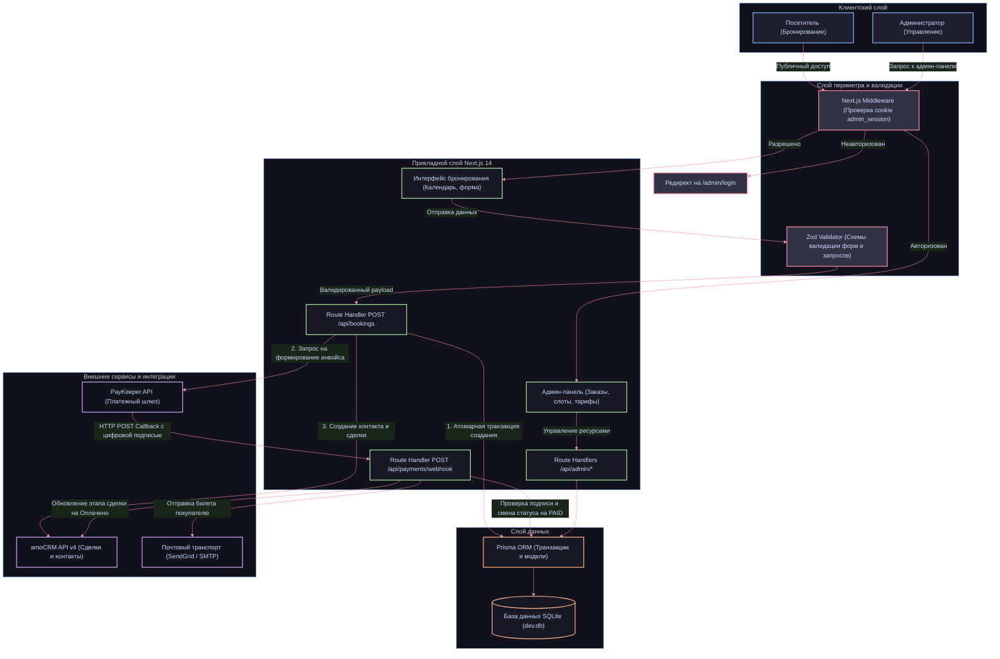

# 🦙 LuLu Alpaca Farm — Сервис онлайн-бронирования и оплаты экскурсий

Платформа полного цикла для автоматизации экскурсионной деятельности фермы альпак «ЛуЛу»: от интерактивного выбора слота в календаре и онлайн-эквайринга до синхронизации с воронкой продаж в CRM-системе и защищенного администрирования.

> Проект разработан с нуля за 3 дня в рамках межрегионального ИТ-хакатона в Екатеринбурге и занял 1 место.

---

## О проекте

Экоферма альпак «ЛуЛу» столкнулась с потребностью в полной автоматизации клиентского потока и отказе от ручной обработки заявок через мессенджеры. За три дня соревнований команда спроектировала и запустила production-ready прототип сервиса, объединяющий пользовательскую витрину, защищенный кабинет администратора и внешние бизнес-интеграции.

* **Формат разработки:** ИТ-хакатон (Екатеринбург), 72 часа непрерывного цикла разработки.
* **Результат:** 1 место среди студенческих и профильных команд.
* **Авторы проекта:** Платон Федотов, Владислав Бекасов.
* **Архитектурный подход:** Full-stack монолит на базе Next.js 14 App Router, обеспечивающий минимальную задержку взаимодействия клиентской части и серверных Route Handlers.

---

## Ключевая функциональность

### Клиентский путь
* **Интерактивный календарь:** Наглядный выбор экскурсионных дней с автоматическим расчетом доступности и разделением тарифов на будние и выходные дни.
* **Динамическое управление слотами:** Отображение остатка свободных мест в реальном времени с защитой от овербукинга.
* **Категории билетов:** Поддержка раздельного учета взрослых, детских и бесплатных билетов (для детей до 3 лет).
* **Мгновенная оплата:** Формирование индивидуального платежного инвойса и перенаправление на защищенную платежную страницу.
* **Электронный билет:** Автоматическая отправка письма с деталями экскурсии, координатами локации и памяткой посетителя сразу после подтверждения транзакции.

### Интеграции с бизнес-сервисами
* **Платежный шлюз PayKeeper:** Генерация счетов через REST API шлюза, обработка асинхронных серверных уведомлений (вебхуков) с обязательной криптографической проверкой цифровой подписи (Secret Key). Предусмотрен изолированный демо-режим для тестирования транзакций без списания средств.
* **CRM-система amoCRM:** Синхронизация клиентской базы и сделок через официальный API v4. При оформлении заявки система находит или создает контакт, заводит сделку в целевой воронке, проставляет кастомные поля (дату визита, состав билетов, ссылку на оплату). При поступлении платежа сделка автоматически переводится на этап «Оплачено».
* **Почтовый транспорт (SendGrid / SMTP):** Двухрежимный модуль рассылки почты с поддержкой SendGrid API и прямого SMTP-транспорта (Яндекс, Gmail, корпоративные почтовые сервера). Формирование адаптивных брендированных HTML-шаблонов.

### Административная панель
* **Управление заказами:** Сводный реестр всех бронирований с отображением статусов оплаты (PENDING, PAID, CANCELLED), контактных данных и истории транзакций.
* **Регенерация платежей:** Возможность повторной генерации платежных ссылок прямо из панели управления для клиентов с прерванной сессией оплаты.
* **Конструктор слотов:** Создание новых временных интервалов, настройка лимита вместимости групп, оперативное закрытие или удаление слотов.
* **Тарифная сетка:** Управление стоимостью категорий билетов и правилами привязки тарифов к расписанию недели.

---

## Архитектура системы

Система построена на принципах модульности и строгой валидации входящих данных на каждом уровне прохождения запроса:



---

## Стек технологий

| Слой | Технология | Назначение |
| :--- | :--- | :--- |
| Core Framework | Next.js 14 (App Router) | Единая full-stack платформа для серверного рендеринга и API |
| Язык разработки | TypeScript 5 | Строгая сквозная типизация интерфейсов, моделей и API |
| Пользовательский интерфейс | React 18, Tailwind CSS | Реактивные компоненты и утилитарная верстка интерфейса |
| Компонентная база | Radix UI, Lucide React | Доступные примитивы интерфейса и векторная графика |
| Управление состоянием форм | React Hook Form, Zod | Валидация входных структур данных и обработка состояний ввода |
| Клиентский кэш | TanStack React Query v5 | Асинхронное получение данных слотов и синхронизация состояния |
| Слой базы данных | Prisma ORM 5 | Типобезопасное взаимодействие с БД и проведение транзакций |
| Хранилище данных | SQLite | Локальная реляционная база данных для высокой скорости развертывания |
| Платежная интеграция | PayKeeper API | Серверное взаимодействие с эквайрингом и прием вебхуков |
| CRM интеграция | amoCRM API v4 | Управление лидами, сделками и контактной базой |
| Почтовые нотификации | SendGrid API, Nodemailer | Доставка сервисных писем с подтверждением оплаты |

---

## Безопасность и архитектурные решения

* **Изоляция маршрутов (Middleware):** Доступ к административной панели регламентирован на уровне Next.js Edge Middleware. Проверка защищенного cookie-токена `admin_session` выполняется до рендеринга страниц и исполнения контроллеров.
* **Строгая верификация данных (Zod):** Все пользовательские формы и тела запросов валидируются строгими схемами. Отсекаются некорректные номера телефонов, невалидные email-адреса и попытки резервирования отрицательного или нулевого числа билетов.
* **Транзакционность бронирования:** Резервирование мест и создание записи бронирования выполняются в рамках единой атомарной транзакции Prisma `$transaction`. Это полностью исключает состояние гонки (race condition) и гарантирует целостность емкости слота.
* **Валидация входящих вебхуков:** Обработчик платежных нотификаций проверяет подлинность запроса с помощью сверки контрольной цифровой подписи, вычисленной на основе секретного ключа.

---

## Быстрый старт

### Требования к окружению
* Node.js: версия 18.17.0 или выше
* Пакетный менеджер: npm 9+

### 1. Клонирование и установка зависимостей
```bash
git clone <URL_РЕПОЗИТОРИЯ>
cd <ДИРЕКТОРИЯ_ПРОЕКТА>
npm install
```

### 2. Конфигурация переменных окружения
Скопируйте эталонный файл конфигурации и при необходимости укажите боевые ключи интеграций:
```bash
cp .env.example .env
```

### 3. Инициализация базы данных и сидинг
Примените схему Prisma к локальной базе данных SQLite и заполните ее стартовыми тарифами и слотами:
```bash
npx prisma migrate dev
npm run prisma:seed
```

### 4. Запуск сервера разработки
```bash
npm run dev
```

Приложение будет доступно по адресу: `http://localhost:3000`  
Административная панель: `http://localhost:3000/admin`  
(Учетные данные по умолчанию указаны в вашем файле `.env`).

---

## Доступные npm-скрипты

* `npm run dev` — запуск Next.js в режиме разработки с поддержкой Fast Refresh.
* `npm run build` — оптимизированная сборка проекта для production.
* `npm run start` — запуск скомпилированного production-сервера.
* `npm run lint` — статический анализ кодовой базы с помощью ESLint.
* `npm run prisma:generate` — генерация типизированного клиента Prisma Client.
* `npm run prisma:migrate` — применение миграций схемы базы данных.
* `npm run prisma:seed` — заполнение базы демонстрационными данными (слоты, тарифы).
* `npm run prisma:studio` — запуск визуального веб-интерфейса Prisma Studio для инспекции БД.

---

## Авторы

* **Платон Федотов** — Full-stack Developer, System Architect
* **Владислав Бекасов** — Full-stack Developer, Integration Engineer
